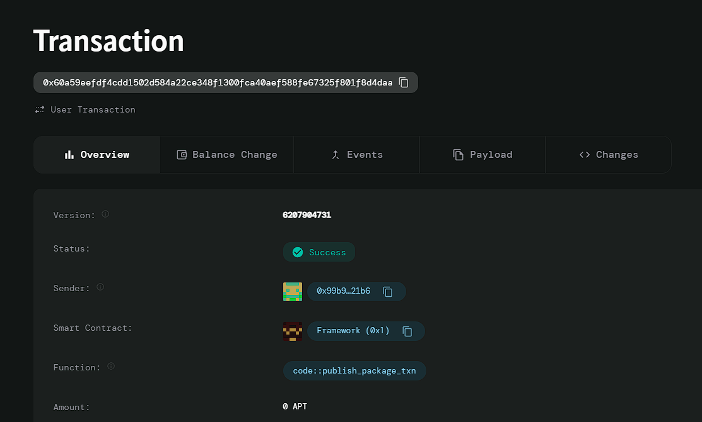

# Decentralized Prediction Market

# Deployed ID: 0x60a59eefdf4cdd1502d584a22ce348f1300fca40aef588fe67325f801f8d4daa

## Project Description
The Decentralized Prediction Market is a platform where users can create and trade predictions on real-world events, with outcomes verified by smart contracts. This market incentivizes accurate forecasting and allows participants to profit from their insights while fostering community engagement in various topics.

## Project Vision
The vision of the Decentralized Prediction Market is to create a transparent and trustworthy platform for users to share their predictions and insights on real-world events, ultimately leading to a more informed community and better decision-making.

## Key Features
- **User-Generated Predictions**: Users can create their own predictions on various topics, encouraging diverse participation.
- **Smart Contract Verification**: Outcomes are automatically verified by smart contracts, ensuring fairness and transparency in the prediction process.
- **Community Engagement**: Participants can engage with each other, sharing insights and fostering a collaborative environment.
- **Incentives for Accurate Forecasting**: Users can profit from their predictions, creating a financial incentive for accurate forecasting and informed decision-making.
